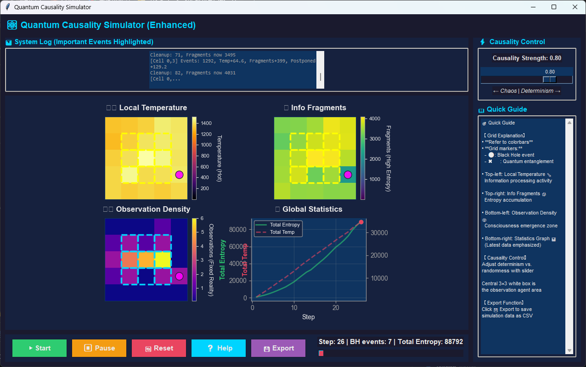

# Quantum Causality Simulator (Enhanced)


> **A real-time, interactive thought-experiment that visualises the idea that the universe is an information-processing system.**  
> Adjust the **causality strength** (determinism vs chaos), watch **black-hole events**, **quantum entanglement**, and **observation-driven reality** emerge on a 5×5 cellular grid.

---

## Screenshots

| Main UI |
|--------|---------------|
|   |

*(Add screenshots to `screenshots/` folder and update the paths above.)*

---

## Features

| Feature | Description |
|---------|-------------|
| **5×5 Grid Visualisation** | Four live heat-maps: <br>• **Local Temperature** (inferno) <br>• **Entropy Fragments** (viridis) <br>• **Observation Density** (plasma) <br>• **Global Statistics** |
| **Causality Slider** | Real-time control of `CAUSALITY_STRENGTH` (0.0 = pure chaos, 1.0 = full determinism). |
| **Black-Hole Events** | Random cells become pink circles and dissipate information. |
| **Quantum Entanglement** | Cyan “X” marks appear on entangled pairs; observation on one affects the other. |
| **Observation Agent** | Central 3×3 area has higher observation probability – the “consciousness zone”. |
| **CSV Export** | Click **Export** to save per-step data (entropy, temperature, BH count, entanglement, causality). |
| **Dark-Neon UI** | Modern, fully-styled Tkinter with hover effects, progress bar, and loading overlay. |
| **Help Window** | Detailed guide with colour-scale explanations and philosophy notes. |

---

## Installation

```bash
git clone https://github.com/<snowbellsan>/quantum-causality-simulator.git
cd quantum-causality-simulator
python -m venv venv
source venv/bin/activate      # Windows: venv\Scripts\activate
pip install -r requirements.txt
